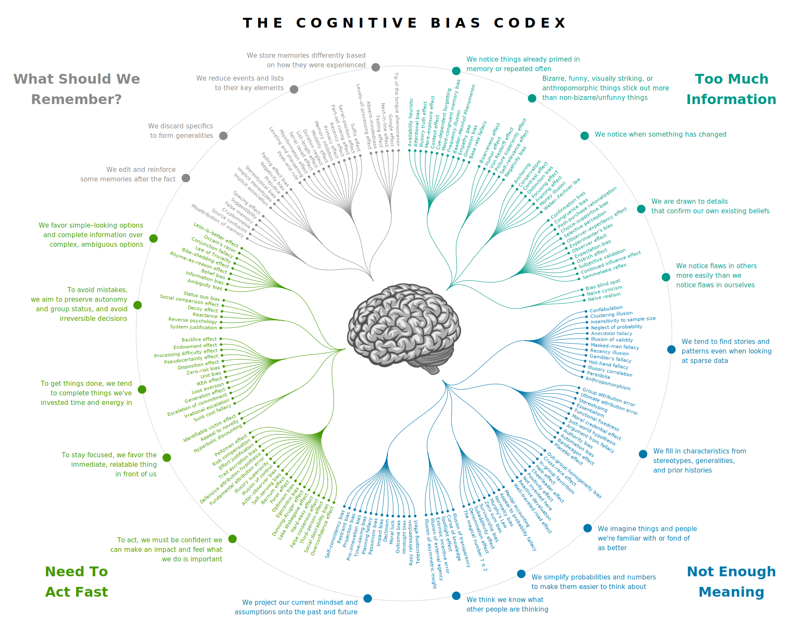
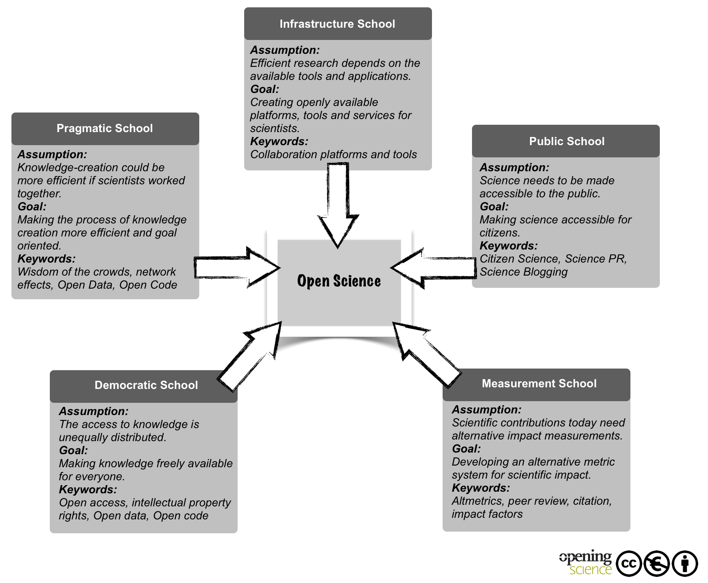

<style>
slides > slide:not(.nobackground):after {
  content: '';
}
</style>

```{r setup, include=FALSE}
knitr::opts_chunk$set(echo = FALSE)
library(shiny)
```


# A (typical?) story | of a young researcher

<div class="notes">
JURE (Junior Researchers of EARLI):
"shaping your research career"
my naive assumption: where and how to get best training to become an outstanding researcher

* publish (or perish) as much as possible in high ranked journals
* get grants

</div>

<div class="myfooter">
  slides:  [osf.io/64mbt](https://osf.io/64mbt/)
</div>


## Incentive structures | in scholarly communication


<div class="box45l" style="margin-top:10%">
`r icon(name = "star", lib = "font-awesome")` novelty  
  
`r icon(name = "thumbs-up", lib = "font-awesome")` positive results
  
  
  <span class="mysource">[@nosek_scientific_2012-1]</span>  
</div>

<div class="box45r1">
</div>

<div class="myfooter">
  slides:  [osf.io/64mbt](https://osf.io/64mbt/)
</div>


## Degrees of freedom | in the research process


<div class="box45l">

* multitude of decisions to be made

</div>

<div class="myfooter">
  slides:  [osf.io/64mbt](https://osf.io/64mbt/)
</div>


## Degrees of freedom | in the research process


<div class="box45l">

* multitude of decisions to be made

\

`Are football (soccer) referees more likely to give red cards to players with dark skin than to players with light skin?`

* 29 research teams
* same data set
* same results?

<span class="mysource">[@silberzahn_crowdsourced_2015]</span>

</div>

<div class="myfooter">
  slides:  [osf.io/64mbt](https://osf.io/64mbt/)
</div>

## Degrees of freedom | in the research process


<div class="box45l">

* multitude of decisions to be made

\

`Are football (soccer) referees more likely to give red cards to players with dark skin than to players with light skin?`

* 29 research teams
* same data set
* same results?

<span class="mysource">[@silberzahn_crowdsourced_2015]</span>

</div>

<div class="box45r2">

</div>

<div class="notes">

* clustered standard errors or multilevel?
* which cases to seleect / deselect?
* Bayesian Modelling?
* Likert Scales as ordinal or interval?
* which covariates should be taken into account?

</div>

<div class="myfooter">
  slides:  [osf.io/64mbt](https://osf.io/64mbt/)
</div>

## Nobody's perfect - cognitive biases
<div class="myfooter">
  slides:  [osf.io/64mbt](https://osf.io/64mbt/)
</div>

## Nobody's perfect - cognitive biases

<object data="../webs/cb.svg" type="image/svg+xml" height="100%" style="position:absolute; top:0; left:9%">

</object>

## Nobody's perfect - cognitive biases

<div class="box45l" style="margin-top:10%">
`r icon(name = "check-circle", lib = "font-awesome")` confirmation bias  
  
`r icon(name = "eye", lib = "font-awesome")` hindsight bias
  
  
  <span class="mysource">[@munafo_manifesto_2017]</span>  
</div>

<div class="notes">

__confirmation__: tendency to focus on evidence that is in line with our expectations
__hindsight__: tendency to see an event as having been predictable only after it occured

</div>

<div class="box45r3">
</div>

<div class="myfooter">
  slides:  [osf.io/64mbt](https://osf.io/64mbt/)
</div>


## QRP | Questionable Research Practices

<div class="box45l" style="margin-top:10%">
`r icon(name = "random", lib = "font-awesome")` outcome switching/ failing to report all DV  
  
`r icon(name = "clone", lib = "font-awesome")` failing to report all conditions  
  
`r icon(name = "star-half-alt", lib = "font-awesome")` selectively reporting studies that "worked"  
  
<span class="mysource">[@john_measuring_2012]</span>  
</div>
  


<div class="box45r4">
<p style="font-size:3em; line-height:1em; margin-top:45%;">selective <br />reporting</p>
</div>

<div class="myfooter">
  slides:  [osf.io/64mbt](https://osf.io/64mbt/)
</div>

## QRP | Questionable Research Practices

<div class="box45l" style="margin-top:10%">
`r icon(name = "hand-paper", lib = "font-awesome")` peeking & optional stopping
  
`r icon(name = "eraser", lib = "font-awesome")` excluding data (after looking at the impact)  
  
`r icon(name = "undo-alt", lib = "font-awesome")` HARKing  
  
<span class="mysource">[@john_measuring_2012]</span>  
</div>

<div class="box45r5">
<p style="font-size:3em; line-height:1em; margin-top:45%;">flexibility<br />in methods</p>
</div>

<div class="myfooter">
  slides:  [osf.io/64mbt](https://osf.io/64mbt/)
</div>

# Open Science (Practices)

## What is Open Knowledge?

<div class="container" style="margin-top:10%;">
<div style="display: inline-block; padding:5px; background-color:#326E1E; opacity:.7; color: white;">
<span style="font-size:4em;">`r icon(name = "quote-right", lib = "font-awesome")`</span>
</div>
<div style="width:45%; padding:10px; background-color:#326E1E; opacity:.7; color: white;">
<span style="font-size:1.5em; line-height:1em;">
Knowledge is open if anyone is free to access, use, modify, and share it - subject, at most, to measures that preserve provenance and openness.
</span>
</div>
</div>
\
\
  
<span class="mysource">[Open Knowledge Foundation](https://opendefinition.org/od/2.1/en/)</span>

<div class="myfooter">
  slides:  [osf.io/64mbt](https://osf.io/64mbt/)
</div>

## What is Open Science?

<div class="container" style="margin-top:10%;">
<div style="display: inline-block; padding:5px; background-color:#0069AA; opacity:.5; color: white;">
<span style="font-size:4em;">`r icon(name = "quote-right", lib = "font-awesome")`</span>
</div>
<div style="width:45%; padding:10px; background-color:#0069AA; opacity:.5; color: white;">
<span style="font-size:1.5em; line-height:1em;">Open science is the movement to make scientific research, data and dissemination __accessible__ to all levels of an inquiring society.</span>
</div>
</div>
\
\
  
<span class="mysource">[FOSTER Open Science](https://www.fosteropenscience.eu/taxonomy/term/7)  
[@woelfle_open_2011]</span>

<div class="myfooter">
  slides:  [osf.io/64mbt](https://osf.io/64mbt/)
</div>

## <span style="float:right">Open Science Principles</span>

<div class="box45l1"></div>

<div class="box45r" style="margin-top:20%">
1. open access
2. open data
3. open source & materials
4. open methodology
5. open peer review
6. open educational resoures
<span class="mysource">[@piwowar_data_2013]</span>
</div>

<div class="myfooter">
  slides:  [osf.io/64mbt](https://osf.io/64mbt/)
</div>

## &nbsp;


<div style="opacity: .6; font-size: .7em; margin-top:57%; margin-left:8%">[@bartling_open_2014]</div>


## What's in it for me?

<div style="position: absolute; top:15%; left:0; width:100%; height:85vh;">

<iframe src="https://embed.polleverywhere.com/free_text_polls/SLahqp0QzZsKYDBf8tTKV?controls=all&short_poll=true" width="100%" height="87vh" frameBorder="0"></iframe>
</div>

<div class="myfooter">
  slides:  [osf.io/64mbt](https://osf.io/64mbt/)
</div>


## <span style="margin-left:35%">What's in it for me?</span>


<div class="box45l" style="margin-top:8%; width:60%; margin-left:38%">

* OA articles `r icon(name = "arrows-alt-h", lib = "font-awesome")` higher citation rate<br />&nbsp;<span class="mysource">[@lewis_open_2018]</span>
* Preprint + Publication `r icon(name = "arrows-alt-h", lib = "font-awesome")` higher citation rate<br />&nbsp;<span class="mysource">[@fraser_effect_2019]</span> 


</div>

<div class="box45r6">
<p style="font-size:7em; line-height:3.8em">`r icon(name = "award", lib = "font-awesome")`</p>
</div>

<div class="myfooter">
  slides:  [osf.io/64mbt](https://osf.io/64mbt/)
</div>

## <span style="margin-left:35%">What's in it for me?</span>


<div class="box45l" style="margin-top:8%; width:60%; margin-left:38%">

* OA articles `r icon(name = "arrows-alt-h", lib = "font-awesome")` higher citation rate<br />&nbsp;<span class="mysource">[@lewis_open_2018]</span>
* Preprint + Publication `r icon(name = "arrows-alt-h", lib = "font-awesome")` higher citation rate<br />&nbsp;<span class="mysource">[@fraser_effect_2019]</span> 
* Open data `r icon(name = "arrows-alt-h", lib = "font-awesome")` higher citation rate<br />&nbsp;<span class="mysource">[@piwowar_data_2013]</span>
* Data papers in Open Data Journals<br />&nbsp;<span class="mysource">[(incomplete list of journals)](https://www.forschungsdaten.org/index.php/Data_Journals)</span>


</div>

<div class="box45r6">
<p style="font-size:7em; line-height:3.8em">`r icon(name = "award", lib = "font-awesome")`</p>
</div>

<div class="myfooter">
  slides:  [osf.io/64mbt](https://osf.io/64mbt/)
</div>

## <span style="margin-left:35%">What's in it for me?</span>


<div class="box45l" style="margin-top:8%; width:60%; margin-left:38%">

* OA articles `r icon(name = "arrows-alt-h", lib = "font-awesome")` higher citation rate<br />&nbsp;<span class="mysource">[@lewis_open_2018]</span>
* Preprint + Publication `r icon(name = "arrows-alt-h", lib = "font-awesome")` higher citation rate<br />&nbsp;<span class="mysource">[@fraser_effect_2019]</span> 
* Open data `r icon(name = "arrows-alt-h", lib = "font-awesome")` higher citation rate<br />&nbsp;<span class="mysource">[@piwowar_data_2013]</span>
* Data papers in Open Data Journals<br />&nbsp;<span class="mysource">[(incomplete list of journals)](https://www.forschungsdaten.org/index.php/Data_Journals)</span>
* Facilitate collaboration<br />&nbsp;
* Feedback `r icon(name = "long-arrow-alt-right", lib = "font-awesome")` improvement<br />&nbsp;
* ...

</div>

<div class="box45r6">
<p style="font-size:7em; line-height:3.8em">`r icon(name = "award", lib = "font-awesome")`</p>
</div>

<div class="myfooter">
  slides:  [osf.io/64mbt](https://osf.io/64mbt/)
</div>


# Hands-on part

* storing & organizing materials on OSF
* non-proprietary, reproducible Online Survey Tool
* documentation of scales (to ensure usability)

## &nbsp;


## projects on OSF


<div class="box45l" style="margin-top:5%">
* create `new project`
  + accessibility settings on _private_
* create `project component` "survey structure & codebook"
  + accessibility settings on _public_
* create `data component` "free data for free people"
  + accessibility settings on _public_
</div>

<div class="box45r4">
<p style="font-size:3em; line-height:1em; margin-top:55%; color:white;">OSF</p>
</div>


## formr | Online Survey Tool

<div class="box45l" style="margin-top:5%">
* observe survey, compare with google-sheet
  + Which kind of items are the ones you'd use in future research?
* create one survey page
  + with multiple and different items that seem interesting for future research
* create run
  + "tmp_..." as first survey
  + "skip" as second survey
  + "skip" should be skipped, on the basis of a condition you define
  + try other options? Randomization, Loop, ...
</div>

<div class="box45r5">
<p style="font-size:3em; line-height:1em; margin-top:55%; color:white;">formr.org</p>
</div>

<div class="myfooter">
  slides:  [osf.io/64mbt](https://osf.io/64mbt/)
</div>


# bit.ly/iwm-os

* scroll down
* click on "launch binder"


## documentation of scales

<div class="box45l" style="margin-top:5%">
3 different codebooks

* compare codebooks
  + which elements are good for reproducibility, which less so?
* look what's "behind the scenes" (in the .Rmd files)

<span class="mysource">[@arslan_how_2019]</span>
</div>


<div class="box45r5">
<p style="font-size:3em; line-height:1em; margin-top:55%; color:white;">codebook</p>
</div>

<div class="myfooter">
  slides:  [osf.io/64mbt](https://osf.io/64mbt/)
</div>

## how to stay at it | committing


<div class="box45l" style="margin-top:10%">

* [researchtransparency.org](http://www.researchtransparency.org/)
* [opennessinitiative.org](https://opennessinitiative.org/)
* ...

</div>

<div class="box45r7">
</div>

<div class="myfooter">
  slides:  [osf.io/64mbt](https://osf.io/64mbt/)
</div>

## how to stay at it | information & community

<div class="box45l">

* twitter ([how-to](https://osf.io/43fks/))
  + @ TuebingenOSI 
  + @ artzyatfailing2
* streamed conferences
  + OSC
  + SIPS
* [Open Science MOOC](https://opensciencemooc.eu/)
* podcasts
  + Open Science Radio
  + ORION Open Science
  + Everything Hertz
  + The Black Goat
  + Circle of Willis
  
</div>

<div class="box45r8">
</div>

<div class="myfooter">
  slides:  [osf.io/64mbt](https://osf.io/64mbt/)
</div>


# Thank you 

__Jürgen Schneider__  
  
juergen.schneider@uni-tuebingen.de  
07071-29 76088  
[ORCID: 0000-0002-3772-4198](https://orcid.org/0000-0002-3772-4198)


## tools used

* [rstudio.cloud](https://rstudio.cloud/)
* [binder](https://github.com/binder-examples/r) together with [holepunch](https://karthik.github.io/holepunch/articles/getting_started.html)
* [formr](https://formr.org)
* [flex_dashboard](https://rmarkdown.rstudio.com/flexdashboard/)
* [codebook](https://github.com/rubenarslan/codebook)
* [osf](https://osf.io/) (alternative: [zenodo](https://zenodo.org/))

# Pictures

<span style="font-size:.8em">
__title page__ | [Finn Hackshaw](https://unsplash.com/@finnhackshaw) on [Unsplash](https://unsplash.com)  
__light bulbs__ | [Dragos Gontariu](https://unsplash.com/@dragos126) on [Unsplash](https://unsplash.com)  
__six__ | [Clem Onojeghuo](https://unsplash.com/@clemono2) on [Unsplash](https://unsplash.com)  
__signature__ | [Helloquence](https://unsplash.com/@helloquence) on [Unsplash](https://unsplash.com)  
__trello__ | [Matthew Guay](https://unsplash.com/@maguay) on [Unsplash](https://unsplash.com)  
__biases__ |  <a href="https://commons.wikimedia.org/wiki/User:Jm3">John Manoogian III</a>, categories & descriptions: Buster Benson, implementation: <a href="https://commons.wikimedia.org/wiki/User:TilmannR">TilmannR</a>, <a href="https://creativecommons.org/licenses/by-sa/4.0/legalcode" rel="license">CC BY-SA 4.0</a> 
</span>

#
<style>
slides > slide:not(.nobackground):after {
  content: '';
}
</style>
